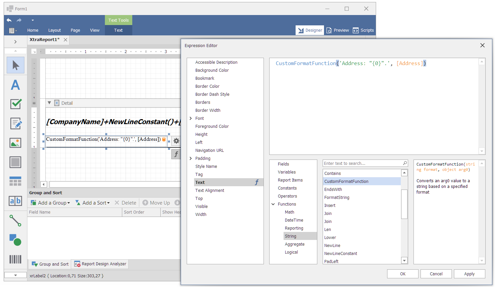

# How to Implement Custom Functions in the Expression Editor

This example adds custom functions to the list of functions available in the [Expression Editor](https://docs.devexpress.com/WindowsForms/6212/common-features/expressions/expression-editor)
invoked in the [WinForms End-User Report Designer](https://docs.devexpress.com/XtraReports/10715/winforms-reporting/end-user-report-designer).

This example implements the following functions:

1. The **NewLineConstant** function allows you to insert a new line into a string.

    This function uses the [Environment.NewLine](https://msdn.microsoft.com/en-us//library/system.environment.newline(v=vs.110).aspx) constant that returns a new line string defined for the current environment.
    You should enable the [XRLabel.Multiline](https://docs.devexpress.com/XtraReports/DevExpress.XtraReports.UI.XRLabel.Multiline) property to enable line breaks in the XRLabel text.

1. The **CustomFormatFunction(string format, object arg0)** function accepts a format string and a value to format.

    The function's Evaluate method uses the [String.Format](https://msdn.microsoft.com/en-us/library/fht0f5be(v=vs.110).aspx) method to format a static string, data field, or a calculated field value.

Do the following to add a custom function to the End-User Report Designer's Expression Editor:

1. Implement the [ICustomFunctionOperatorBrowsable](https://docs.devexpress.com/CoreLibraries/DevExpress.Data.Filtering.ICustomFunctionOperatorBrowsable) interface to define your new custom function.
1. Call the [CustomFunctions.Register](https://docs.devexpress.com/XtraReports/DevExpress.XtraReports.Expressions.CustomFunctions.Register(DevExpress.Data.Filtering.ICustomFunctionOperator--)) method to register the implemented interface in the Report Designer.

## Files to Look At

* [CustomFormatFunction.cs](./CS/CustomFunctionForExpressionEditorExample/Functions/CustomFormatFunction.cs) (VB: [CustomFormatFunction.vb](./VB/CustomFunctionForExpressionEditorExample/Functions/CustomFormatFunction.vb))
* [NewLineFunction.cs](./CS/CustomFunctionForExpressionEditorExample/Functions/NewLineConstant.cs) (VB: [NewLineFunction.vb](./VB/CustomFunctionForExpressionEditorExample/Functions/NewLineConstant.vb))
* [Program.cs](./CS/CustomFunctionForExpressionEditorExample/Program.cs) (VB: [Program.vb](./VB/CustomFunctionForExpressionEditorExample/Program.vb))

## Documentation

* [Custom Functions in the Expression Editor (WinForms)](https://docs.devexpress.com/XtraReports/403294/winforms-reporting/end-user-report-designer-for-winforms/api-and-customization/custom-functions-in-the-expression-editor)
* [How to use a custom function in a query expression](https://supportcenter.devexpress.com/ticket/details/t352441/how-to-use-a-custom-function-in-a-query-expression)
* [Custom Functions](https://docs.devexpress.com/WindowsForms/9947/common-features/expressions/implementing-custom-functions)
* [How to: Implement a Custom Criteria Language Function Operator](https://docs.devexpress.com/XPO/5206/examples/how-to-implement-a-custom-criteria-language-function-operator)
